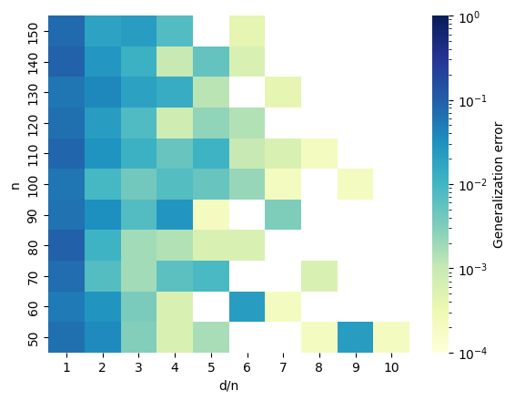
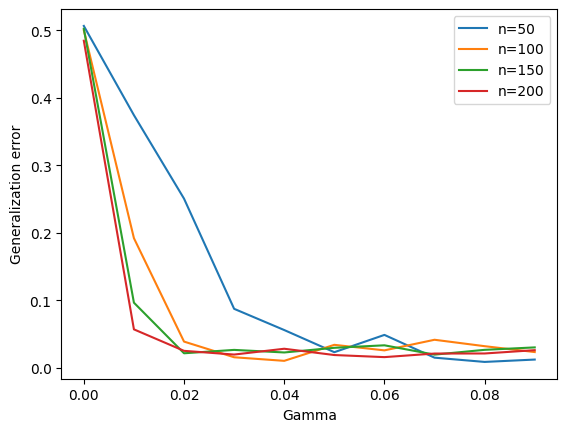

### Benign overfitting in leaky ReLU networks with moderate input dimension

Numerical experiments for our [paper](https://arxiv.org/abs/2403.06903) on benign overfitting appearing in NeurIPS 2024. To reproduce our experiments, see the notebook ``experiments.ipynb``.

